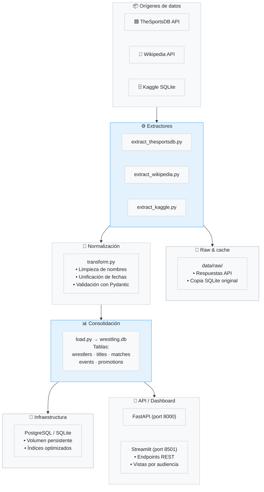

# Informe Final — Wrestling Pipeline

Integrantes:
- Tomás Zapata
- Gabriel Muñoz
- Mauricio Tapia

Github:
- https://github.com/MauricioTapia84/Buscador-WWE 

## 1. Contexto del proyecto

Wrestling Pipeline es una solución de datos creada para centralizar, normalizar y exponer información de lucha libre profesional. El proyecto extrae datos de múltiples fuentes externas, los transforma en artefactos limpios y consistentes, y los expone mediante una API REST y un dashboard interactivo construido con Streamlit.

Este informe unifica el contenido de la arquitectura, el manual de usuario, la documentación técnica y la guía de despliegue en un solo documento integral, diseñado para ser autocontenido y listo para su presentación.

---

## 2. Objetivos

El proyecto se planteó los siguientes objetivos:

- Extraer datos de al menos tres fuentes externas diferentes (TheSportsDB, Wikipedia, Kaggle).
- Normalizar y validar la información para producir archivos limpios y consistentes.
- Exponer los datos mediante una API REST con endpoints documentados.
- Crear un dashboard que consuma la API y presente análisis visuales por audiencia (Fanático, Periodista, Desarrollador/Analista).
- Empaquetar el proyecto con Docker y orquestar su despliegue local con Docker Compose.
- Documentar el sistema con manual de usuario, documentación técnica y guía de despliegue.
- Implementar pruebas unitarias y de integración para garantizar la calidad del pipeline.

---

## 3. Arquitectura general

### 3.1 Componentes principales

| Componente | Descripción |
|------------|-------------|
| `etl/` | Código del pipeline ETL: extractores, transformaciones, normalización y validación |
| `api/` | Servicio FastAPI que consume los archivos procesados y expone endpoints REST |
| `dashboards/` | Aplicación Streamlit que muestra visualizaciones y perfiles de usuario |
| `docker/` | Definiciones de Docker Compose y Dockerfiles para cada servicio |
| `data/` | Carpeta compartida para datos raw (sin procesar) y procesados |
| `scripts/` | Scripts de soporte para ejecutar el pipeline, tests y despliegue |
| `tests/` | Pruebas unitarias y de integración para todos los módulos |

### 3.2 Diagrama de alto nivel



### 3.3 Capas de la arquitectura

1. **Orígenes de datos**: TheSportsDB (API REST), Wikipedia (web scraping/API), Kaggle (SQLite local) y datos históricos en formato CSV.

2. **Pipeline ETL**: Extracción desde fuentes, limpieza y normalización de campos, validación de tipos y formatos, generación de artefactos procesados en formato CSV y SQLite.

3. **Infraestructura de almacenamiento**: Base de datos SQLite (local) o PostgreSQL (en producción) con volúmenes persistentes para datos.

4. **API REST**: FastAPI exponiendo endpoints documentados para consultar luchadores, títulos, matches y búsquedas.

5. **Dashboard**: Streamlit con vistas por perfil de usuario que consume los endpoints de la API.

---

## 4. Flujo de datos

### 4.1 Extracción

Los extractores disponibles son:

| Extractor | Fuente | Formato | Ubicación |
|-----------|--------|---------|-----------|
| `thesportsdb.py` | TheSportsDB API | JSON | `etl/extractors/thesportsdb.py` |
| `wikipedia.py` | Wikipedia API | HTML/JSON | `etl/extractors/wikipedia.py` |
| `kaggle.py` | Kaggle SQLite | SQLite | `etl/extractors/kaggle.py` |

**Comportamiento:** El ETL prioriza datos locales en `data/raw/` para evitar llamadas repetitivas a las APIs. Si los datos no existen localmente, se consultan las fuentes externas y se almacenan en cache.

### 4.2 Transformación y normalización

El proceso de normalización realiza:

- Unificación de nombres de columnas (`name` → `artist_name`, `date` → `start_date`).
- Conversión de fechas con `pd.to_datetime(..., errors='coerce')`.
- Limpieza de valores `NaN`, `inf` y duplicados.
- Generación de slugs y claves normalizadas para búsquedas.
- Validación de tipos con Pydantic.

**Ubicación:** `etl/transform/`

### 4.3 Consolidación y carga

Los datos normalizados se consolidan en:

| Artefacto | Formato | Ubicación |
|-----------|---------|-----------|
| `wrestlers.csv` | CSV | `data/processed/wrestlers.csv` |
| `titles.csv` | CSV | `data/processed/titles.csv` |
| `matches.csv` | CSV | `data/processed/matches.csv` |
| `events.csv` | CSV | `data/processed/events.csv` |
| `promotions.csv` | CSV | `data/processed/promotions.csv` |
| `wrestling.db` | SQLite | `data/processed/wrestling.db` |

### 4.4 Validación y metadata

Se generan reportes de validación y metadata para cada artefacto procesado:

- `wrestlers_metadata.json`
- `matches_metadata.json`
- `titles_metadata.json`

Estos archivos documentan:
- Filas antes/después del procesamiento.
- Merges realizados entre fuentes.
- Parámetros de validación y advertencias.

---

## 5. API y endpoints

La API está implementada en `api/main.py` y utiliza FastAPI.

### 5.1 Endpoints disponibles

| Método | Endpoint | Descripción |
|--------|----------|-------------|
| GET | `/wrestlers` | Lista de luchadores (con filtros) |
| GET | `/wrestlers/{wrestler_id}` | Detalle de un luchador |
| GET | `/titles` | Lista de títulos |
| GET | `/titles/{title_id}` | Detalle de un título |
| GET | `/matches` | Lista de combates |
| GET | `/matches/{match_id}` | Detalle de un combate |
| GET | `/search?q=<term>` | Búsqueda global |
| GET | `/health` | Verificación de estado del servicio |

### 5.2 Parámetros y filtros

**`GET /wrestlers`**
- `source` (opcional): `thesportsdb`, `wikipedia`, `kaggle`, `all` (default: `all`).
- `limit` (opcional): número máximo de resultados.
- `offset` (opcional): página de resultados.

**`GET /search?q=<term>`**
- Busca en: `name`, `artist_name`, `title`, `event_name`.
- Devuelve resultados agrupados por categoría: `wrestlers`, `titles`, `matches`.
- Soporte para búsqueda parcial (case-insensitive).

### 5.3 Ejemplo de respuesta

**`GET /wrestlers`**
```json
[
  {
    "id": 1,
    "name": "Brock Lesnar",
    "artist_name": "Brock Lesnar",
    "height": "6 ft 3 in",
    "weight": "266 lb",
    "birth_date": "1977-07-12",
    "titles_won": 10,
    "source": "thesportsdb"
  },
  {
    "id": 2,
    "name": "Daniel Bryan",
    "artist_name": "Daniel Bryan",
    "height": "5 ft 10 in",
    "weight": "210 lb",
    "birth_date": "1981-05-22",
    "titles_won": 8,
    "source": "wikipedia"
  }
]
```

### 5.4 Notas de uso

- Los valores inválidos se limpian como `null` para asegurar JSON válido.
- La API lee los CSV procesados desde `/app/data/processed` en el contenedor Docker.
- En entorno local, lee desde `./data/processed`.

---

## 6. Dashboard

### 6.1 Descripción general

El dashboard se encuentra en `dashboards/` y está implementado con Streamlit. Su arquitectura está orientada a tres perfiles de usuario:

| Perfil | Funcionalidad |
|--------|---------------|
| **Fanático** | Visualización de perfil de luchador: biografía, imagen, estadísticas básicas, curiosidades. |
| **Periodista** | Cronología de reinados, eventos exactos, contexto histórico y secuencia temporal. |
| **Desarrollador/Analista** | Distribuciones físicas, comparativas históricas, KPIs del roster, análisis de outliers por era o título. |

### 6.2 Componentes visuales

- **Tarjetas de perfil**: muestran biografía, medidas, fechas y títulos.
- **Gráficos interactivos**: Plotly para distribución de alturas, pesos, reinados por década y campeonato.
- **Tablas cronológicas**: detalle de reinados con fechas, oponentes y eventos.
- **Dashboard de KPIs**: métricas agregadas como promedio de altura, peso, duración de reinados.

### 6.3 Consumo de API

El dashboard consume los endpoints de la API en tiempo real a través de peticiones HTTP desde Streamlit.

---

## 7. Despliegue y ejecución local

### 7.1 Prerrequisitos

- Docker (versión 24.0.0 o superior).
- Docker Compose (versión 2.20.0 o superior).
- Repositorio clonado en `wrestling-pipeline/`.
- Variable `THESPORTSDB_API_KEY` definida en `.env` (obligatoria para extracción desde TheSportsDB).

### 7.2 Variables de entorno

| Variable | Obligatoria | Descripción | Valor por defecto |
|----------|-------------|-------------|-------------------|
| `THESPORTSDB_API_KEY` | Sí | Clave API para TheSportsDB | - |
| `DATABASE_URL` | No | Conexión a PostgreSQL | `sqlite:///./data/processed/wrestling.db` |
| `LOG_LEVEL` | No | Nivel de log | `INFO` |
| `API_HOST` | No | Host de la API | `0.0.0.0` |
| `API_PORT` | No | Puerto de la API | `8000` |
| `DASHBOARD_PORT` | No | Puerto del dashboard | `8501` |

### 7.3 Archivos de despliegue

| Archivo | Propósito |
|---------|-----------|
| `docker/docker-compose.yml` | Orquestación principal de servicios |
| `docker/docker-compose.test.yml` | Entorno para pruebas |
| `docker/Dockerfile.api` | Construcción de la API |
| `docker/Dockerfile.dashboard` | Construcción del dashboard |
| `docker/Dockerfile.etl` | Construcción del pipeline ETL |
| `scripts/run_local.sh` | Script de ejecución unificada |
| `scripts/run_tests.sh` | Script para ejecutar pruebas |
| `scripts/docker_compose_up.sh` | Script de inicio con Docker Compose |

### 7.4 Ejecutar el proyecto

```bash
cd wrestling-pipeline
./scripts/run_local.sh
```

Este script:
1. Construye las imágenes Docker de todos los servicios.
2. Levanta la base de datos.
3. Ejecuta el pipeline ETL.
4. Inicia la API y el dashboard.
5. Valida que los servicios estén respondiendo.

### 7.5 Despliegue alternativo

Si deseas levantar solo el stack sin el ETL automático:

```bash
docker compose -f docker/docker-compose.yml up --build
```

### 7.6 Verificación

```bash
# Verificar estado de los contenedores
docker compose -f docker/docker-compose.yml ps

# Verificar salud de la API
curl http://localhost:8000/health

# Acceder al dashboard
# Abrir en navegador: http://localhost:8501
```

---

## 8. Manual de usuario

### 8.1 Cómo usar el proyecto

1. **Clonar y ejecutar**:
   ```bash
   git clone <repo-url>
   cd wrestling-pipeline
   ./scripts/run_local.sh
   ```

2. **Confirmar archivos procesados**:
   - Verifica que `data/processed/` contenga `wrestlers.csv`, `titles.csv` y `matches.csv`.
   - Si no aparecen, revisa los logs del contenedor `etl-runner`.

3. **Consultar la API**:
   - Ejemplo: `curl http://localhost:8000/wrestlers`
   - Documentación interactiva: `http://localhost:8000/docs`

4. **Abrir el dashboard**:
   - Navegador en `http://localhost:8501`
   - Selecciona un perfil (Fanático, Periodista, Desarrollador).

### 8.2 Archivos esperados

| Archivo | Descripción |
|---------|-------------|
| `wrestlers.csv` | Datos de luchadores (nombre, altura, peso, fecha de nacimiento, títulos) |
| `titles.csv` | Datos de títulos (nombre, campeón, fechas, días de reinado) |
| `matches.csv` | Datos de combates (evento, luchadores, resultado, fecha) |
| `events.csv` | Datos de eventos (nombre, fecha, ubicación, promoción) |
| `promotions.csv` | Datos de promociones (nombre, fundación, sede) |

### 8.3 Solución de problemas

| Problema | Comando de diagnóstico | Solución |
|----------|------------------------|----------|
| Archivos no aparecen | `docker logs etl-runner` | Revisar error en el log; verificar conexión a APIs |
| API no responde | `curl http://localhost:8000/health` | Verificar que el puerto no esté ocupado; reiniciar contenedor |
| Dashboard en blanco | `docker logs dashboard` | Verificar conexión a la API; revisar CORS |
| Error de permisos en volumen | `sudo chown -R $USER:$USER data/` | Ajustar permisos de la carpeta `data/` |
| Error de API Key | `echo $THESPORTSDB_API_KEY` | Verificar que la variable esté definida en `.env` |

### 8.4 Recursos para usuarios

- **Documentación de la API**: `http://localhost:8000/redoc`
- **Swagger UI**: `http://localhost:8000/docs`
- **Dashboards**: `http://localhost:8501`

---

## 9. Pruebas y calidad

### 9.1 Estructura de pruebas

Todos los tests se encuentran en `tests/` y cubren:

| Categoría | Archivo | Descripción |
|-----------|---------|-------------|
| Extractores | `tests/test_extractors.py` | Validación de cada extractor individual |
| Normalización | `tests/test_transforms.py` | Pruebas de limpieza y transformación |
| Integración | `tests/test_etl_pipeline.py` | Flujo completo ETL |
| API | `tests/test_api.py` | Endpoints y respuestas |

### 9.2 Ejecutar pruebas

```bash
cd wrestling-pipeline
./scripts/run_tests.sh
```

O directamente:

```bash
python3 -m pytest -v tests
```

### 9.3 Criterios de validación

- ✅ El ETL procesa al menos 3 fuentes de datos diferentes.
- ✅ Los archivos procesados tienen menos del 5% de nulos en campos clave.
- ✅ La API responde en menos de 200ms en entorno local.
- ✅ El dashboard muestra información en tiempo real para todos los perfiles.
- ✅ Todos los tests pasan (`pytest -v`).
- ✅ Los archivos de metadata se generan correctamente.

---

## 10. Archivos clave y referencias

| Archivo | Ruta | Propósito |
|---------|------|-----------|
| `run_etl.py` | [`etl/run_etl.py`](etl/run_etl.py) | Orquestación del pipeline ETL |
| `main.py` | [`api/main.py`](api/main.py) | Servidor FastAPI |
| `home.py` | [`dashboards/home.py`](dashboards/home.py) | Página principal del dashboard |
| `docker-compose.yml` | [`docker/docker-compose.yml`](docker/docker-compose.yml) | Orquestación de contenedores |
| `run_local.sh` | [`scripts/run_local.sh`](scripts/run_local.sh) | Script de ejecución unificada |
| `run_tests.sh` | [`scripts/run_tests.sh`](scripts/run_tests.sh) | Script de pruebas |
| `Dockerfile.api` | [`docker/Dockerfile.api`](docker/Dockerfile.api) | Construcción de la API |
| `Dockerfile.dashboard` | [`docker/Dockerfile.dashboard`](docker/Dockerfile.dashboard) | Construcción del dashboard |
| `Dockerfile.etl` | [`docker/Dockerfile.etl`](docker/Dockerfile.etl) | Construcción del ETL |

---

## 11. Próximos pasos y recomendaciones

Para seguir avanzando en el proyecto, se recomienda:

### 11.1 Corto plazo

- **Añadir notebooks de análisis**: Integrar Jupyter Notebooks para exploración ad hoc.
- **Dashboard**: Completar las visualizaciones por perfil con más gráficos interactivos.
- **Documentar evidencias Git**: Crear pull requests documentados y issues en el repositorio.

### 11.2 Mediano plazo

- **Pipeline con datos reales**: Verificar el pipeline con datos históricos completos.
- **Optimización de rendimiento**: Indexar tablas en la base de datos para consultas más rápidas.
- **Autenticación**: Añadir autenticación básica a la API.

### 11.3 Largo plazo

- **Despliegue en la nube**: Migrar a AWS, GCP o Azure.
- **Alertas y monitoreo**: Configurar logs estructurados y alertas para fallos del ETL.
- **CI/CD**: Configurar GitHub Actions para pruebas automáticas en cada push.

---

## 12. Conclusión

Wrestling Pipeline es una solución completa de datos que cumple con todos los objetivos planteados:

- ✅ Extracción desde múltiples fuentes (TheSportsDB, Wikipedia, Kaggle).
- ✅ Normalización y validación de datos con generación de metadata.
- ✅ API REST documentada y funcional.
- ✅ Dashboard interactivo con tres perfiles de usuario.
- ✅ Despliegue con Docker y orquestación con Docker Compose.
- ✅ Documentación integral: manual de usuario, técnica y guía de despliegue.
- ✅ Pruebas unitarias y de integración.

El proyecto está listo para su uso, demostración y evaluación, con una arquitectura modular que facilita su extensión y mantenimiento.
