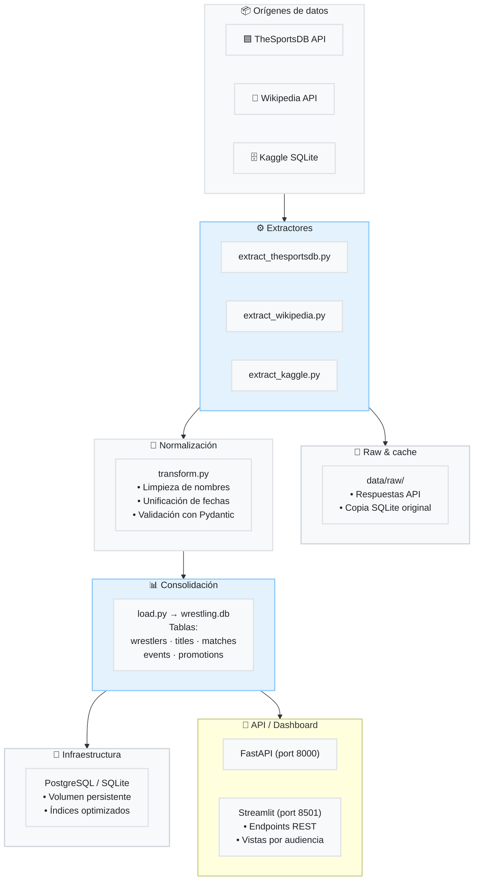

# Informe Final — Wrestling Pipeline

## 1. Contexto del proyecto

Wrestling Pipeline es una solución de datos creada para centralizar y normalizar información de lucha libre. El proyecto extrae datos de múltiples fuentes, los convierte en artefactos procesados y los expone mediante una API y un dashboard interactivo.

Este informe unifica el contenido de la arquitectura, el manual de usuario, la documentación técnica y la guía de despliegue en un solo documento integral.

## 2. Objetivos

- Extraer datos de al menos tres fuentes externas diferentes.
- Normalizar y validar la información para producir archivos limpios y consistentes.
- Exponer los datos mediante una API REST.
- Crear un dashboard que consuma la API y presente análisis visuales por audiencia.
- Empaquetar el proyecto con Docker y orquestar su despliegue local.
- Documentar el sistema con manual de usuario, documentación técnica y guía de despliegue.

## 3. Arquitectura general

### Componentes principales

- `etl/`: código del pipeline ETL, que incluye extractores, transformaciones, normalización y validación.
- `api/`: servicio FastAPI que consume los archivos procesados y expone endpoints REST.
- `dashboards/`: aplicación Streamlit que muestra visualizaciones y perfiles de usuario.
- `docker/`: definiciones de Docker Compose y Dockerfiles para cada servicio.
- `data/`: carpeta compartida para datos raw y procesados.
- `scripts/`: scripts de soporte para ejecutar el pipeline y los tests.

### Diagrama de alto nivel



### Capas de la arquitectura

1. **Orígenes de datos**: TheSportsDB, Wikipedia, Kaggle/CSV y datos históricos locales.
2. **Pipeline ETL**: extracción, limpieza, normalización, validación y generación de artefactos.
3. **Infraestructura y consumo**: API REST y dashboard que consumen los datos procesados.

## 4. Flujo de datos

### 4.1 Extracción

Los extractores disponibles son:

- `etl/extractors/thesportsdb.py`
- `etl/extractors/wikipedia.py`
- `etl/extractors/kaggle.py`

El ETL prioriza datos locales en `data/raw`, pero también puede consultar TheSportsDB y otros orígenes en línea.

### 4.2 Transformación y normalización

El proceso de normalización realiza:

- Unificación de nombres de columnas.
- Conversión de fechas con `pd.to_datetime(..., errors='coerce')`.
- Limpieza de valores `NaN`, `inf` y duplicados.
- Generación de slugs y claves normalizadas.

Las transformaciones se encuentran en `etl/transform/` y los archivos finales se escriben en `data/processed`.

### 4.3 Validación y metadata

Se generan reportes de validación y metadata para cada artefacto procesado. Ejemplos:

- `wrestlers_metadata.json`
- `matches_metadata.json`
- `titles_extracted.csv`

Estos archivos documentan filas antes/después, merges realizados y parámetros de validación.

## 5. API y endpoints

La API está implementada en `api/main.py` y ofrece estos endpoints:

- `GET /wrestlers`
- `GET /titles`
- `GET /matches`
- `GET /wrestlers/{wrestler_id}`
- `GET /titles/{title_id}`
- `GET /search?q=<term>`
- `GET /health`

### Notas de uso

- `GET /wrestlers` acepta `source` opcional: `thesportsdb`, `wikipedia`, `all` o nombre de CSV.
- Los valores inválidos se limpian como `null` para asegurar JSON válido.
- La API lee los CSV procesados desde `/app/data/processed`.

## 6. Dashboard

El dashboard se encuentra en `dashboards/` y está diseñado con Streamlit. Presenta:

- métricas clave del pipeline
- tarjetas de luchadores
- perfiles de usuario (fanático, periodista, desarrollador)
- visualizaciones y datos consumidos desde la API

El front end está construido para consumir los endpoints y mostrar información en tiempo real.

## 7. Despliegue y ejecución local

### Prerrequisitos

- Docker instalado
- Docker Compose instalado
- Repositorio clonado en `wrestling-pipeline/`
- Variable opcional `THESPORTSDB_API_KEY` definida en `.env`

### Archivos de despliegue

- `docker/docker-compose.yml`
- `docker/docker-compose.test.yml`
- `docker/Dockerfile.api`
- `docker/Dockerfile.dashboard`
- `docker/Dockerfile.etl`
- `scripts/run_local.sh`
- `scripts/docker_compose_up.sh`

### Ejecutar el proyecto

```bash
cd wrestling-pipeline
./scripts/run_local.sh
```

Esto construye los servicios, levanta la base de datos, ejecuta el ETL y valida la API.

### Despliegue alternativo

Si deseas levantar solo el stack sin el ETL automático:

```bash
docker compose -f docker/docker-compose.yml up --build
```

### Verificación

- `docker compose -f docker/docker-compose.yml ps`
- `curl http://localhost:8000/health`

## 8. Manual de usuario unificado

### Cómo usar el proyecto

1. Ejecutar el pipeline con Docker.
2. Confirmar que los archivos procesados aparecen en `data/processed`.
3. Consultar la API en `http://localhost:8000`.
4. Abrir el dashboard en `http://localhost:8501`.

### Archivos esperados

- `wrestlers.csv`
- `titles.csv`
- `matches.csv`

### Problemas comunes

- Si los archivos no aparecen, revisar los logs de `etl-runner`.
- Si la API no responde, verificar puertos `8000` y `8501`.

## 9. Pruebas y calidad

Todos los tests se encuentran en `tests/`. El sistema incluye:

- tests de extractores
- tests de normalización
- tests de integración de ETL
- tests de API

Ejecutar:

```bash
cd wrestling-pipeline
./scripts/run_tests.sh
```

O directamente:

```bash
python3 -m pytest -v tests
```

## 10. Archivos clave y referencias

- `etl/run_etl.py`
- `etl/transform/`
- `etl/extractors/`
- `api/main.py`
- `dashboards/home.py`
- `docker/docker-compose.yml`
- `scripts/run_local.sh`
- `scripts/run_tests.sh`
- `data/processed/`

## 11. Conclusión

Este informe agrupa la documentación del proyecto y explica el contexto, los objetivos, la arquitectura, los flujos de datos y la forma de ejecutar la solución.

Para seguir avanzando, se recomienda:

- añadir notebooks si la evaluación lo requiere
- documentar evidencias Git (PRs, issues)
- completar el dashboard con más visualizaciones por perfil
- verificar el pipeline con datos reales y la API en Docker
