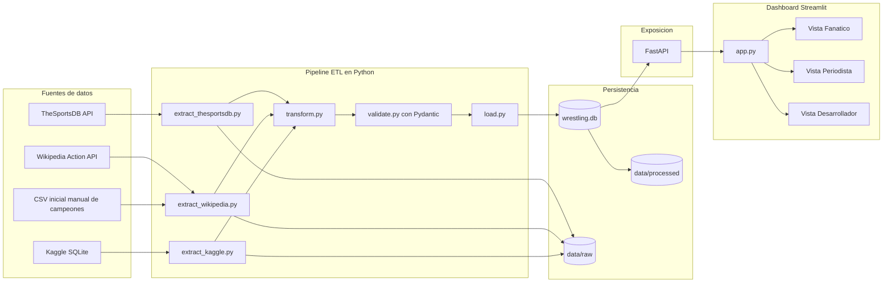

# Diagrama de Arquitectura

## Lectura del flujo

- `Rol A` alimenta el ETL y consolida datos en `wrestling.db`.
- `Rol B` expone la base mediante FastAPI y Docker.
- `Rol C` documenta, deja el CSV semilla, investiga Wikipedia y construye el dashboard que consume la API local.

